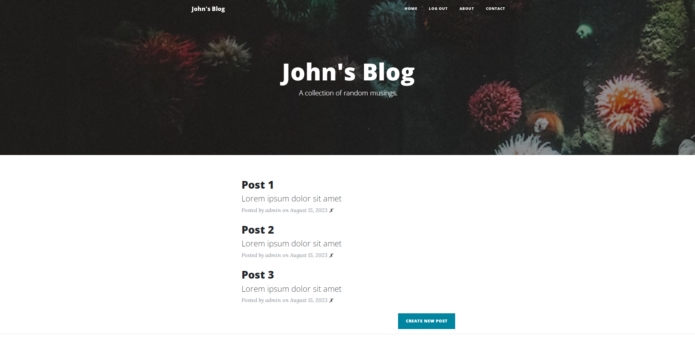
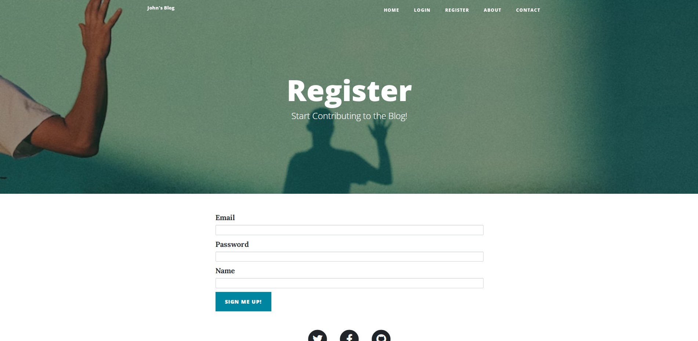
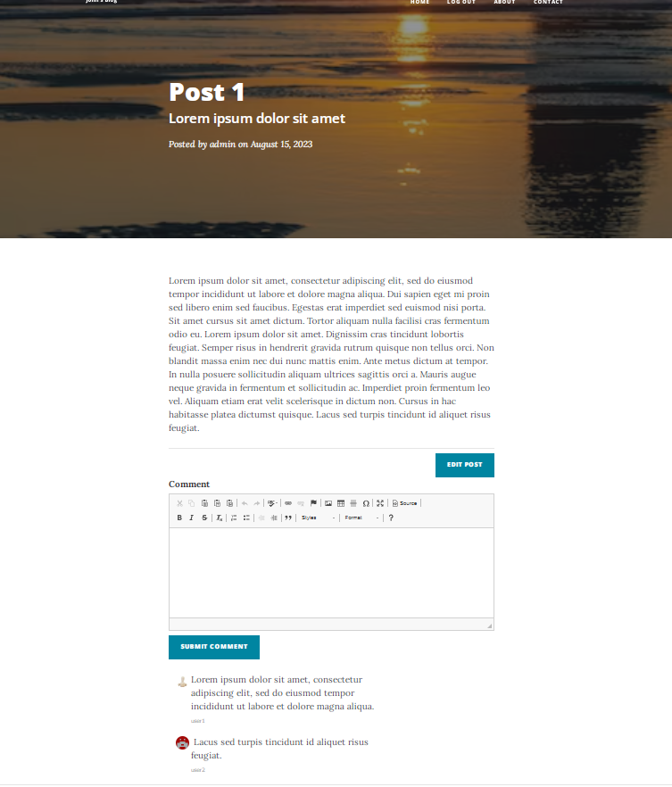

## Flask Blog

This project is a dynamic blog website built using Flask. It features a range of functionalities that allow users to create, edit, and delete posts, leave comments on posts, and manage their accounts.
<br><br>
The application uses Flask extensions to enhance its capabilities:

- Flask Bootstrap: Provides responsive and attractive styling for a user-friendly interface.
- Flask CKEditor: Offers a rich text editing experience, enabling users to format their posts creatively.
- Flask SQLAlchemy: Manages the application's database, handling data storage and retrieval efficiently.
- Flask Login: Implements user authentication, allowing secure login and logout functionality.
- Flask Gravatar: Integrates Gravatar support, automatically displaying user avatars based on their email addresses.
<br>
User authentication is implemented using password hashing for security, and routes are protected with login-required decorators to ensure authorized access. The application's features empower users to interact with the blog content seamlessly.
<br><br>

To run the project locally, clone the repository, set up the required dependencies using ```pip``` , and configure your database. Then, run the Flask development server to see the blog in action.
<br><br>
<ins>Preview:</ins>
<br>
<br>
<br>



